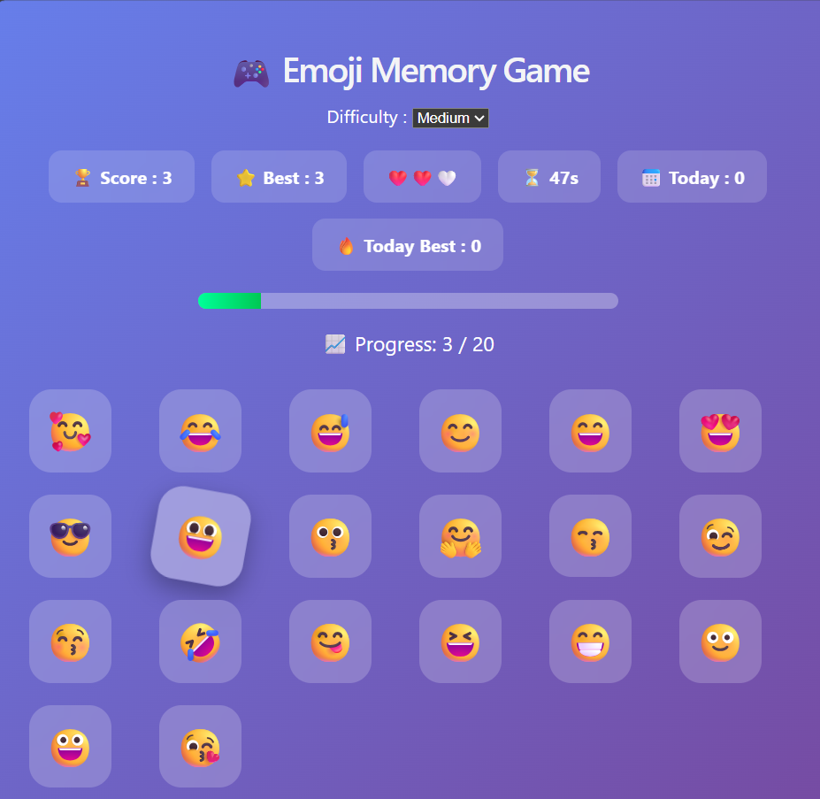

# 🎮 Emoji Memory Game

A fun and interactive Emoji Memory Game built using React.js.

## 🚀 Features

- 😀 30 Emoji Cards
- ❤️ 3 Lives System
- ⏳ 60 Seconds Timer
- ⭐ Easy, Medium & Hard Difficulty Levels
- 🏆 Best Score (LocalStorage)
- 📅 Daily Progress Tracking
- 📈 Progress Bar
- 🔄 Emoji Shuffle After Every Click
- 📱 Responsive Design

## 🛠️ Technologies Used

- React.js
- JavaScript (ES6)
- CSS3
- Vite
- LocalStorage

## 📂 Project Structure

```text
src/
 ├── App.jsx
 ├── App.css
 ├── EmojiCard.jsx
 └── main.jsx
```

## ▶️ Run the Project

```bash
npm install
npm run dev
```

## 📸 Screenshot


## 👩‍💻 Developed By

**Manasa**